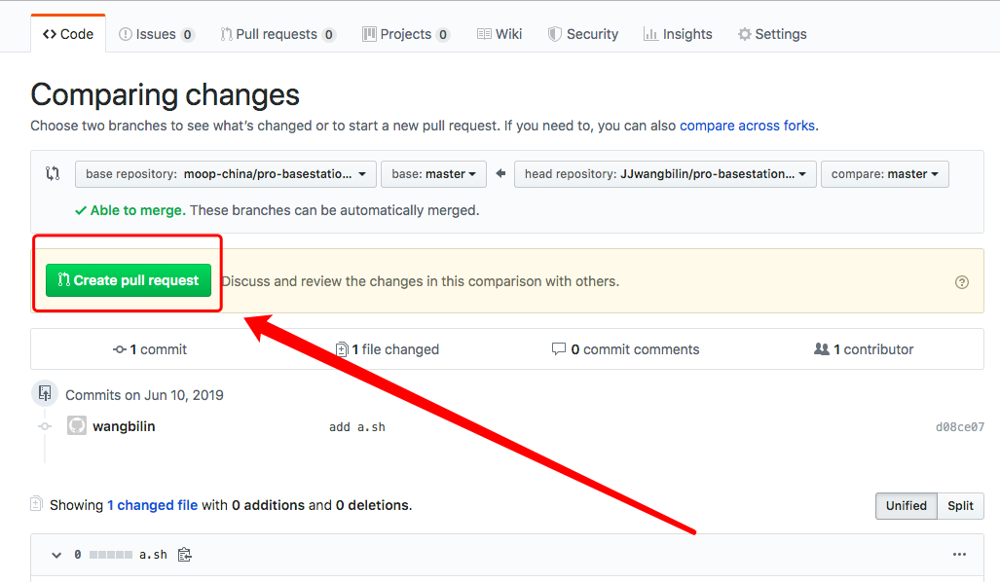

### 1.注册

学生可访问[https://www.mooplab.com](https://www.mooplab.com)进行注册，注册需要邀请码，邀请码请联系管理员获得。


### 2.公开课加入

可加入课程进行学习，需要先"加入学习"，加入学习后可点击图中2所示的按钮，启动相应的实验环境。


### 3.私有课加入

私有课程学生不可加入，需要老师邀请学生，才可加入。


### 4.学习

点击"启动"成功后，可进行相应的学习，界面中心相应的操作如下图所示。


学习界面如下：


### 5.填写实验总结报告

学生根据自身学习的情况，客观评价此次实验的内容。


### 6.回顾课程

学生登录后可查看我的课程，进行回顾。


###  7.个人设置

```
1.维护个人信息，需填写一个唯一编号，便于老师创建私有课程时，进行邀请，如不加入私有课程，学号可不填。
2.密码修改
3.手机绑定，用于找回密码、课程通知等
```

```
关于学号：学号是需管理员预录入到系统中。学生才可填写相应的学号。
```


### 8.其他

###### 8.1 学生的编写的代码，如何同步到自有的git项目中？

- 运行jupyter-teminal

  

  


```
注：学生只对project目录有写权限，对其他目录有读权限
```

- 上传代码


###### 8.2 学生fork的项目，如何同步给owner？

如下图所示，forked from moop-china/pro-basestation-anormaly的项目，同步给moop-china，只需点击图中的Pull request即可。





登陆moop-china，可以选择同意合并或关闭此次请求，如下图所示。

