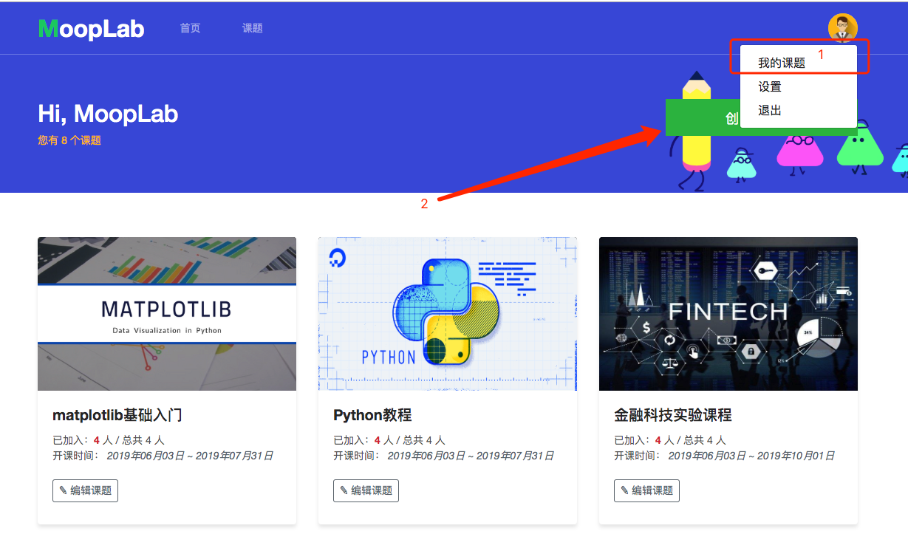
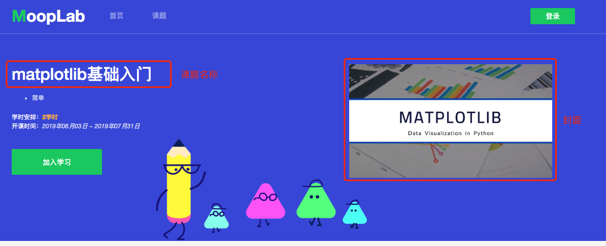
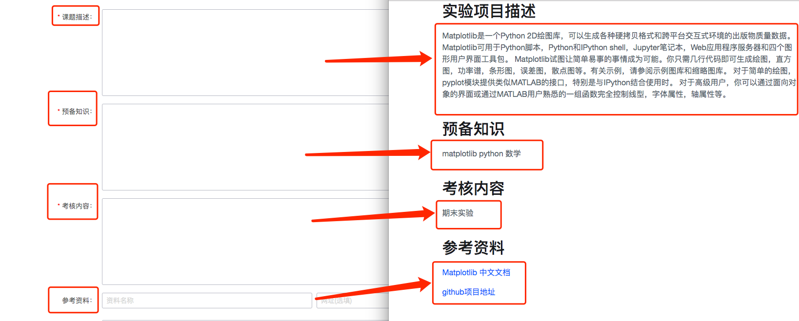
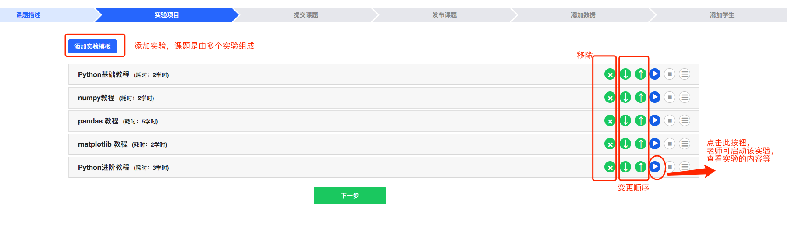
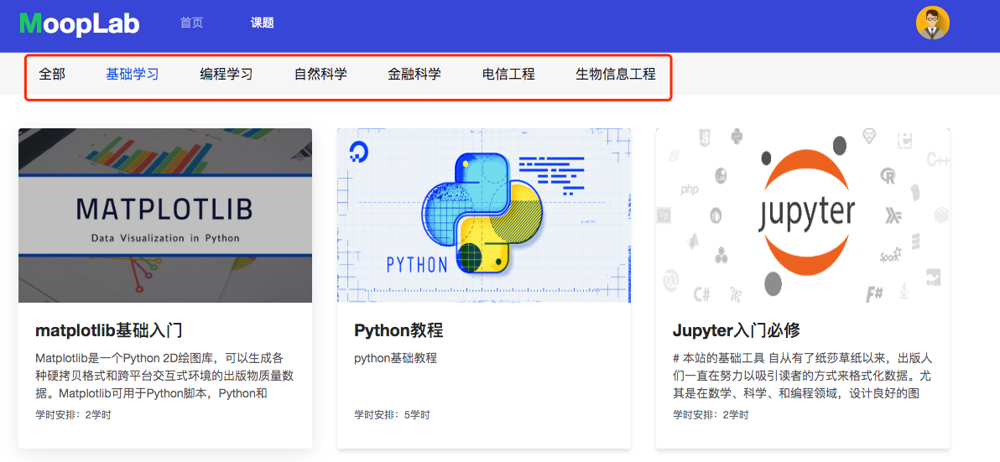
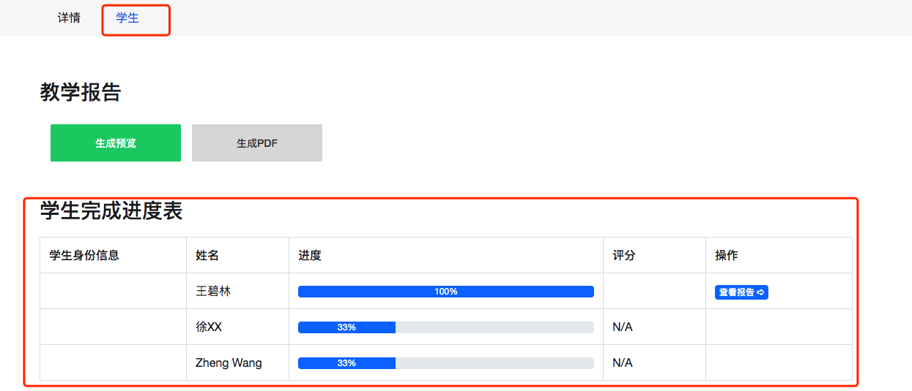
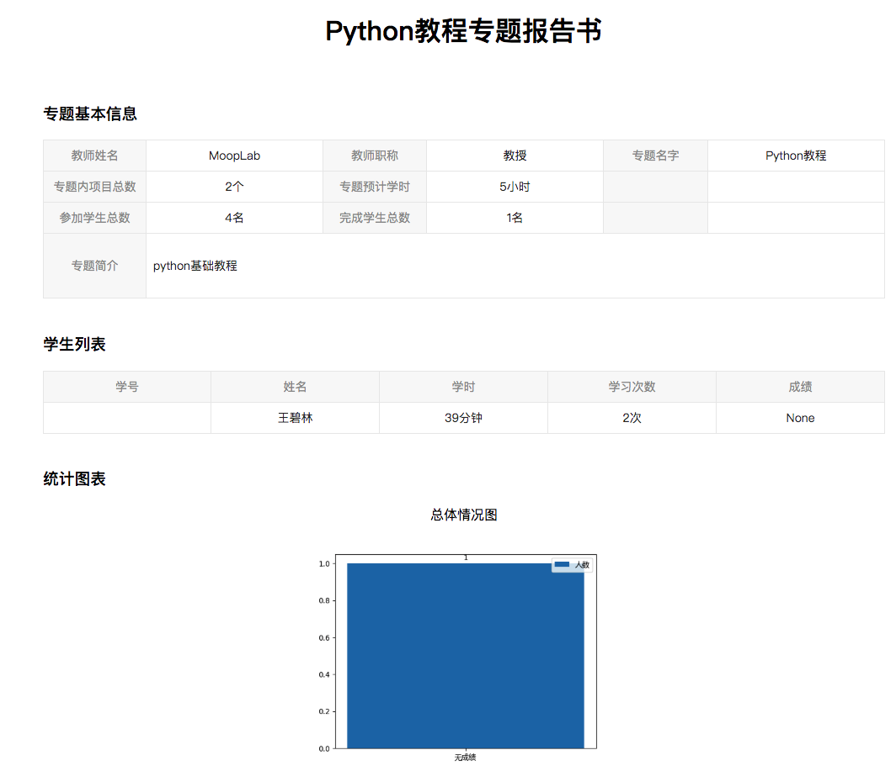

### 1.注册

教师注册需要由管理员进行添加，不提供注册服务。

### 2.创建课题

教师创建课题步骤如下图所示：



填写课题的基础信息，填写的内容和最终课题显示的内容均为一一对应的。

课题名称和封面如下图：






```
公开和私有特别说明
	公开课：平台上的所有人均可主动加入该课程进行学习。
	私有课：除被邀请的人以外，其他任何人只对目录结构可见，无法看到具体的代码内容，且无法加入。
```

填写完成后，下一步选择实验项目(实验项目由研发团队和贡献者提供)，老师可根据实验的难度或相关的关系，进行调整顺序。

```
注：一门课题可由多个实验项目组成，若部分实验模板不可用，请联系管理员进行开通
```



选择课题的开始时间和结束时间，并添加相应的标签，标签可多选，标签对应页面中的课题分类，如下图所示。填写完成后可创建课题。

```
注：
创建后，课题并未发布，需要老师发布后，学生才可见。
```




发布课程后可添加老师私有的内容，内容可以是数据、作业、代码等等。上传是建议对所有的内容进行压缩为.zip格式，直接上传，平台会自动将解压后的内容展示给学生。

如课程为私有课程，老师可添加学生，学生需要先注册才可邀请，邀请学生支持两种方式：

```
1.csv格式，一列学生的唯一学号即可。
2.单条邀请，输入学生的唯一学号即可。
```

### 3.编辑课题

后续使用中，老师可持续修改课题的相应的内容

### 4.评分和导出报告

给学生写评语和相应的评分。



可生成教学报告，教学报告可导出pdf




### 5.项目申报

后续补充